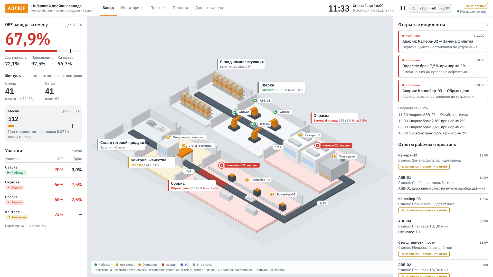
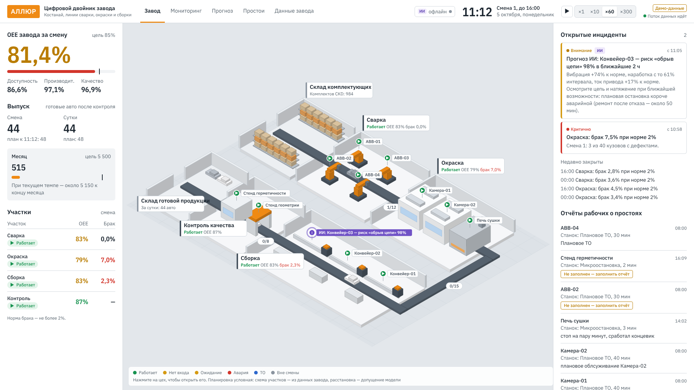
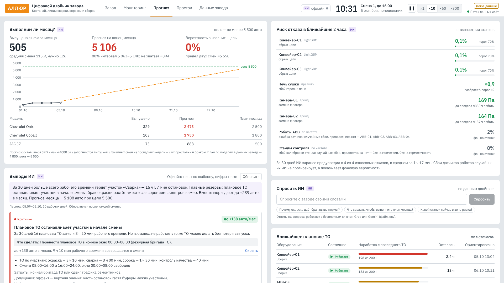
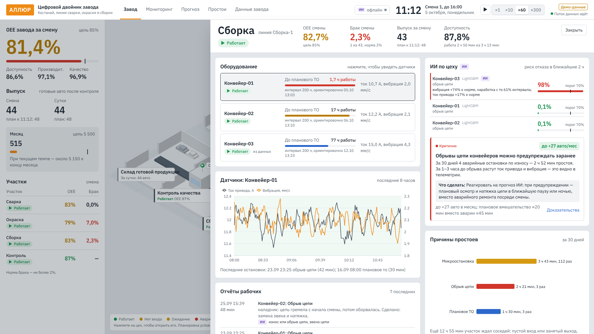
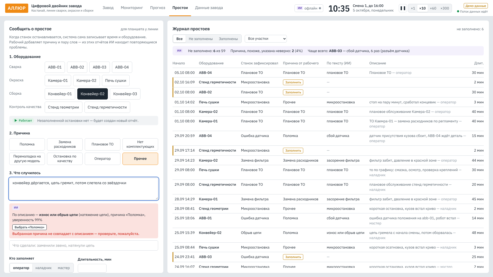

# Цифровой двойник автозавода АЛЛЮР

Прототип для кейса №2 хакатона **Qostanai AI Industry Hackathon 2026** (АО «Группа компаний АЛЛЮР»). Подача материалов — 8 октября, Demo Day — 16 октября 2026.

**Цифровой двойник + ИИ-помощник.**
- **Изометрическая карта завода:** участки и оборудование с состояниями в реальном времени.
- **Страницы цехов:** время до планового ТО, статистика простоев и причин, KPI против целей.
- **Отчёты рабочих о простоях:** ИИ читает текст, подсказывает причину, находит неверно указанные причины и повторяющиеся поломки.
- **Прогноз отказов:** LightGBM по телеметрии предупреждает об обрыве цепи конвейера в среднем за 1,5 часа до аварии.
- **Выводы ИИ:** где завод теряет машины и что делать, с эффектом в авто за месяц. Цифры считает код, текст пишет LLM (бесплатные Groq или Gemini).
- **Прогноз месяца:** выпуск с интервалом и вероятность выполнить цель 5500.

Модель завода построена на тестовых данных организаторов:
- линии Сварка-1, Окраска-1, Сборка-1;
- оборудование ABB-01, Камера-02, Конвейер-03;
- модели Chevrolet Onix, Chevrolet Cobalt, JAC J7;
- целевые показатели: OEE ≥ 85%, брак ≤ 2%, простой ≤ 60 мин/сутки, выпуск ≥ 5500 авто/месяц.



| ИИ предупреждает об обрыве цепи до аварии | Выводы ИИ и прогноз месяца |
|---|---|
|  |  |

| Страница цеха с риском отказа | ИИ подсказывает причину по тексту рабочего |
|---|---|
|  |  |

## Быстрый старт

Нужно: **Python 3.11+** и **Node.js 20+** (или только Docker).

### Вариант 1. Linux / macOS

```bash
make install   # один раз: создаст .venv и поставит зависимости
make dev       # бэкенд :8000 + интерфейс :5173
```

Откройте http://localhost:5173.

### Вариант 2. Windows (PowerShell)

```powershell
python -m venv .venv
.venv\Scripts\pip install -r backend\requirements-dev.txt
cd frontend; npm install; cd ..
.\scripts\dev.cmd
```

Откройте http://localhost:5173 через 10–15 секунд: сервер сначала «проживает» 30 дней работы завода.

`dev.cmd` запускает `dev.ps1` в обход запрета на сценарии PowerShell («не имеет цифровой подписи»). Можно и вручную, в двух окнах PowerShell:
```powershell
# окно 1 — сервер данных (из папки проекта)
cd backend; ..\.venv\Scripts\python -m uvicorn app.main:app --port 8000
# окно 2 — интерфейс (из папки проекта)
cd frontend; npm run dev
```

### Вариант 3. Docker

```bash
docker compose up --build
```

Интерфейс — http://localhost:5173, API — http://localhost:8000/api/health.

### ИИ: бесплатные ключи (необязательно)

Без ключей всё работает офлайн: прогноз отказов, разбор отчётов, выводы по шаблонам. С ключом выводы пишет языковая модель, и работает «Спросить ИИ».

1. Получите бесплатный ключ — достаточно одного:
   - **Groq:** https://console.groq.com/keys (вход через Google или GitHub);
   - **Google Gemini:** https://aistudio.google.com/apikey.
2. Скопируйте `.env.example` в `.env` и впишите ключ:
   ```
   GROQ_API_KEY=gsk_...
   GEMINI_API_KEY=AIza...
   ```
3. Перезапустите сервер. Вверху справа появится «ИИ: Groq» с зелёной точкой.

Ответы LLM кэшируются в `data/ai_cache/`: запустите двойник один раз с интернетом перед показом, и выводы LLM будут доступны без сети.

### Пульт демо

В интерфейсе нажмите **D**. Откроется пульт: скорость времени, сброс к 10:30 и сценарии:
- авария ABB-01;
- износ цепи Конвейера-03 — ИИ предупреждает до обрыва;
- засорение фильтра Камеры-02.

### Режим показа (один процесс, работает без интернета)

```bash
make demo      # соберёт интерфейс и запустит всё на http://localhost:8000
```

## Команды

| Команда | Что делает |
|---|---|
| `make dev` | разработка с автоперезагрузкой |
| `make test` | тесты бэкенда (pytest) и проверка типов фронтенда |
| `make build` | сборка интерфейса в `frontend/dist` |
| `make demo` | сборка и запуск одним процессом на :8000 |
| `make seed` | генерация истории симулятора (этап 1) |
| `make train` | обучение и проверка моделей ИИ (~3 мин), отчёт `docs/ML_REPORT.md`; готовая модель уже в репозитории |

## Структура

```
config/      модель завода (plant.yaml), цели (targets.yaml), причины простоев (reasons.yaml)
data/raw/    тестовые данные организаторов как получены (docx)
data/test/   они же в нормализованных CSV
backend/     FastAPI: API, WebSocket, симулятор, KPI, ИИ (assistant/, ml/), обучение (ml_train/), импорт данных
data/models/ обученная модель прогноза отказов (LightGBM, текстовый формат)
frontend/    React + Vite + TypeScript: интерфейс диспетчерской
docs/        статус, решения, контракты, разбор данных
```

## Документы

- [docs/STATUS.md](docs/STATUS.md) — текущее состояние и следующие шаги
- [docs/TEST_DATA.md](docs/TEST_DATA.md) — тестовые данные, расчёты и решения D1–D11
- [docs/DECISIONS.md](docs/DECISIONS.md) — журнал решений
- [docs/CONTRACTS.md](docs/CONTRACTS.md) — форматы данных, REST и WebSocket
- [docs/ML_REPORT.md](docs/ML_REPORT.md) — модели ИИ: как обучены и как проверены
- [docs/EXPLAIN.md](docs/EXPLAIN.md) — как всё устроено, простыми словами, с вопросами жюри

Данные, которых нет у организаторов (ёмкость буферов, параметры отказов, часть оборудования), — это **допущения модели**. Они помечены в конфигах и в интерфейсе.
