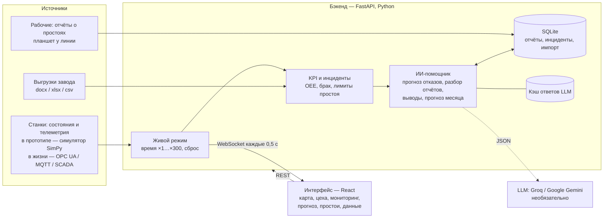

# Техническое описание

Цифровой двойник автозавода АЛЛЮР с ИИ-помощником. Кейс №2, Qostanai AI Industry Hackathon 2026.

Документ для подачи (п. 6.2 положения): архитектура, данные, технологии, внешние компоненты, библиотеки и их назначение (п. 5.8), AI-инструменты разработки (п. 6.4).

## 1. Что делает система

- **Показывает завод в реальном времени:** изометрическая карта участков и оборудования, KPI против целей (OEE, брак, простои, выпуск), инциденты.
- **Собирает второй источник данных — людей.** Станок остановился — создаётся черновик простоя; рабочий на планшете добавляет причину и пару слов.
- **ИИ-помощник:**
  - предупреждает об отказе до аварии;
  - читает отчёты рабочих и находит неверные причины и повторы;
  - формулирует выводы с эффектом в машинах за месяц;
  - прогнозирует выполнение месячного плана;
  - отвечает на вопросы о заводе.

## 2. Архитектура



| Компонент | Где в коде | Что делает |
|---|---|---|
| Симулятор завода | `backend/app/sim/` | Дискретно-событийная модель:<br>• поток кузовов WH → сварка → окраска → сборка → контроль → склад;<br>• буферы, 2 смены, смешанный поток моделей;<br>• отказы по Вейбуллу с предвестниками в телеметрии, плановое ТО по моточасам;<br>• засорение фильтров камер, тексты отчётов рабочих.<br>Откалиброван по тестовым данным. |
| Живой режим | `backend/app/runtime.py`, `ws/` | Модель идёт в реальном времени (×1…×300). Изменения уходят в интерфейс по WebSocket. Мгновенный сброс: запасной мир готовится в фоне. |
| KPI и инциденты | `backend/app/kpi/` | OEE = A × P × Q (цикл 3,8 мин), брак, лимит простоя 60 мин/сутки, отклонения. Эталон OEE по тестовым данным проверяется тестом. |
| Импорт данных | `backend/app/ingest/` | docx, xlsx, csv организаторов → нормализация → KPI, сверка учёта простоев, находки. |
| ИИ | `backend/app/assistant/`, `backend/app/ml/` | Прогноз отказов, классификация отчётов, выводы, прогноз месяца, LLM-клиент (раздел 4). |
| Хранилище | `backend/app/storage/` | SQLite через SQLAlchemy; для завода — та же схема в PostgreSQL/TimescaleDB. |
| Интерфейс | `frontend/src/` | Вкладки «Завод», «Мониторинг», «Прогноз», «Простои», «Данные завода»; страница цеха; пульт демо (клавиша D). |

Контракты REST и WebSocket — `docs/CONTRACTS.md`. Объяснение для команды и вопросы жюри — `docs/EXPLAIN.md`.

## 3. Данные

| Источник | Что это | Как используется |
|---|---|---|
| **Тестовые данные организаторов** (`data/raw/`, `data/test/`) | 2 дня, 3 линии:<br>• план/факт, время работы;<br>• 4 простоя;<br>• брак по участкам;<br>• план по моделям;<br>• цели | Модель завода (линии, оборудование ABB-01, Камера-02, Конвейер-03, модели, цели). Калибровка симулятора. Эталон KPI. Импорт в «Данные завода». |
| **Решения D1–D11** (`docs/TEST_DATA.md`) | Как трактовать пробелы: смена = строка, такт 4 мин, цикл 3,8 мин и т. д. | Закрыты все пробелы данных |
| **Допущения модели A1–A9** (`config/plant.yaml`) | Параметры, которых нет в данных: буферы, отказы, ТО, фильтры | Помечены `source: assumption` и в интерфейсе |
| **Синтетическая история** | Симулятор: 30 суток для живого режима; 5 независимых «лет» по 150 суток для обучения | Обучение и проверка ИИ (D8). Все метрики — демонстрационные. |
| **Отчёты рабочих** | Синтетические тексты с опечатками, сокращениями, неверными причинами; в живом режиме — с формы | Материал для разбора ИИ; скрытая «истина» симулятора — только для оценки качества |

Тестовые данные вымышленные и не секретны (подтверждено командой), поэтому лежат в публичном репозитории.

## 4. ИИ внутри продукта

| Задача | Метод | Качество (на синтетике, `docs/ML_REPORT.md`) |
|---|---|---|
| Прогноз обрыва цепи конвейера за 2 часа | **LightGBM** по телеметрии: ток и вибрация к норме за 15 и 60 мин, тренды, разброс температуры, наработка с ТО. Оценка раз в 5 мин, предупреждение после 2 оценок выше порога. Факторы риска — SHAP-значения | 11 из 11 обрывов предупреждено, медиана упреждения 87 мин, 0 ложных тревог; ROC-AUC 0,92. Простое правило по току — за 51 мин. |
| Сбой горелки печи | Правило «разброс температуры ×2»: отказов мало, модель на них не учится (проверено) | 6 из 7, упреждение ≈12 мин |
| Сбои датчиков роботов | Не прогнозируются — случайные. Фоновая вероятность по частоте | ROC-AUC модели 0,52, то есть угадывание; показано честно |
| Разбор текста отчётов | **TF-IDF** (слова + буквенные n-граммы) + **логистическая регрессия**. Для свободного текста — LLM | 97% на 35 фразах, написанных вручную |
| Выводы с эффектом | Факты и эффект считает код за 30 дней. **LLM** переписывает текст и ставит приоритеты; числа в тексте сверяются с расчётом | 6 видов выводов, эффект до +239 авто/мес |
| Прогноз месяца | Бутстреп по фактическим сменам, 4000 повторов | Факт попал в интервал 10–90% в 12 из 12 проверок |
| Вопросы о заводе | LLM с данными двойника в контексте | только с ключом |

**LLM** — бесплатные API **Groq** (`openai/gpt-oss-120b`, `llama-3.3-70b-versatile`) и **Google Gemini** (`gemini-3.5-flash`, `gemini-3.1-flash-lite`).
- **Ключи** — в файле `.env`. Порядок: Groq, при ошибке или лимите — Gemini.
- **Ответ — JSON.** Ответы кэшируются в `data/ai_cache/`.
- **Без ключа и без сети** работают прогнозы, разбор отчётов и выводы по шаблону.
- **Защита от выдуманных чисел:** каждое число в тексте LLM должно совпасть с числом из расчёта, иначе остаётся шаблон.

## 5. Технологии и библиотеки (п. 5.8)

### Бэкенд, симулятор, ИИ — Python 3.11+

| Библиотека | Версия | Назначение |
|---|---|---|
| FastAPI | 0.142 | REST API и WebSocket |
| Uvicorn | 0.54 | ASGI-сервер |
| Pydantic | 2.13 | проверка входных данных API |
| SQLAlchemy | 2.1 | хранилище отчётов, инцидентов, импортов (SQLite) |
| python-multipart | 0.0.32 | загрузка файлов в импорт |
| PyYAML | 6.0 | конфиги модели завода и целей |
| SimPy | 4.1 | дискретно-событийный симулятор завода |
| NumPy | 2.5 | расчёты, случайные величины симулятора, признаки |
| pandas | 2.3 | таблицы истории, импорт, сводки |
| PyArrow | 25 | хранение истории симулятора (parquet) |
| scikit-learn | 1.9 | TF-IDF и логистическая регрессия (отчёты), метрики ROC-AUC/PR-AUC |
| LightGBM | 4.7 | прогноз отказов оборудования |
| joblib | 1.6 | сохранение модели классификатора |
| httpx | 0.28 | запросы к API Groq и Gemini |
| python-docx | 1.2 | чтение docx с тестовыми данными |
| openpyxl | 3.1 | чтение xlsx при импорте |
| pytest | 8.4 | тесты (55 шт.) |

### Интерфейс — TypeScript, Node.js 20+

| Библиотека | Версия | Назначение |
|---|---|---|
| React | 18.3 | интерфейс |
| Vite | 6.4 | сборка и dev-сервер |
| TypeScript | 5.8 (strict) | типы |
| Tailwind CSS | 4.3 | стили |
| ECharts + echarts-for-react | 6.1 / 3.0 | графики: Парето, OEE по сменам, телеметрия, прогноз месяца |
| Zustand | 5.0 | состояние живого потока |
| @fontsource/ibm-plex-sans, -condensed | 5.3 | шрифты (локально, без интернета) |

Изометрическая карта — собственный SVG без сторонних 3D-движков.

### Внешние сервисы

| Сервис | Обязателен? | Что туда уходит |
|---|---|---|
| Groq API (console.groq.com) | нет | выводы: агрегаты за 30 дней; вопрос пользователя с краткой сводкой; текст отчёта рабочего |
| Google Gemini API (aistudio.google.com) | нет, запасной | то же |

Для завода LLM заменяется локальной моделью (например, через Ollama). Клиент рассчитан на JSON-ответ, интерфейс системы не меняется.

### Запуск и инфраструктура
- **Запуск:** Make, PowerShell и cmd-скрипты для Windows, Docker Compose.
- **Сценарии демо** — кнопками в интерфейсе (клавиша D).
- **Без интернета:** `make demo` — один процесс на порту 8000.

## 6. AI-инструменты, использованные при разработке (п. 6.4)

| Инструмент | Для чего |
|---|---|
| **Claude (Anthropic), модель Claude Opus 5.5** — агентная работа в облачной среде | Разбор кейса и тестовых данных, архитектура. Код бэкенда, симулятора, ИИ и интерфейса, тесты. Документация, расчёт эффекта, презентация, сценарий демо. Скриншоты интерфейса через headless-браузер. |

**Как работала команда:**
- ставила задачи по этапам, вносила изменения в код и дописывала недостающие модули;
- принимала решения: концепция, данные, стиль, бесплатные LLM;
- проверяла работу на своих компьютерах;

**Как держали код понятным для команды:**
- каждый этап описан в `docs/EXPLAIN.md` простым языком, с ответами на вероятные вопросы жюри;
- решения записаны с причинами в `docs/DECISIONS.md`.

Языковые модели Groq и Gemini — часть продукта, а не инструмент разработки. Они описаны в разделе 4.

## 7. Проверка

- **55 автотестов** (pytest):
  - симулятор: детерминизм, калибровка по данным, предвестники;
  - KPI: эталон OEE по тестовым данным с точностью 0,1 п.п.;
  - импорт docx;
  - API и WebSocket;
  - ИИ: клиент Groq/Gemini на подменённой сети, защита от выдуманных чисел, сценарий «обрыв цепи предсказан до аварии».
- **Фронтенд:** проверка типов `tsc` (strict) и сборка Vite.
- **Модели:** `make train` заново обучает и проверяет их на отдельной истории и пишет `docs/ML_REPORT.md`.

## 8. Как запустить

```bash
make install && make dev     # http://localhost:5173
make demo                    # всё одним процессом, http://localhost:8000, без интернета
```
Windows — `scripts\dev.cmd`. Подробнее и про ключи LLM — `README.md`.
